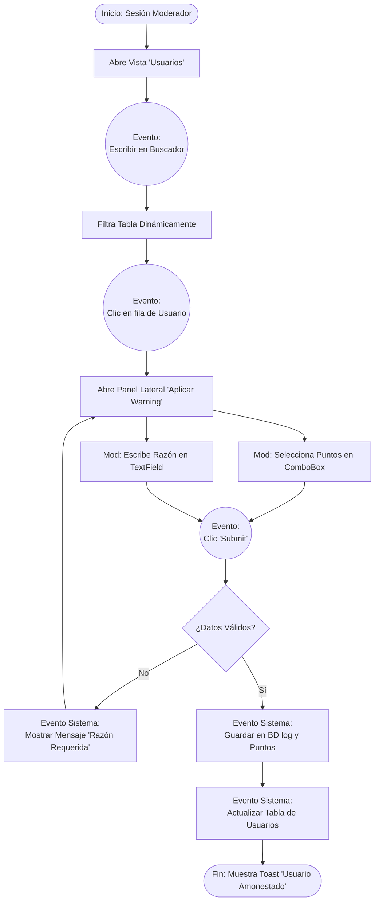

# Entregable Unidad 1: Dashboard Moderador de Discord

Este documento contiene los elementos solicitados para la entrega de la **Unidad 1** del proyecto integrador (Adaptación de un Bot de Discord).

## 1. Documento de formalización de proyecto

Este punto se cubre llenando y firmando los documentos en PDF proporcionados por el docente (`Proyecto Integrador.pdf` y `Responsabilidades por Rol.pdf`).

* **Nombre sugerido para el proyecto:** Dashboard de Monitoreo y Gestión en Tiempo Real para Bot de Discord.
* *(Nota: Asegúrense de subir los PDF firmados junto con este documento).*

## 2. Boceto de Interfaces

El siguiente boceto ilustra la propuesta visual del Panel de Control principal, enfocado en la gestión de la comunidad. Esta ventana será desarrollada en la Unidad 1.


## 3. Usuarios

El sistema está diseñado para ser utilizado principalmente por los miembros del equipo de administración de una comunidad en Discord. Se identifican dos tipos de usuarios que interactuarán con este Dashboard:

1. **Administrador Principal (Owner):** Tiene acceso total al panel. Puede ver todas las estadísticas globales, modificar la configuración sensible del bot, configurar el "automod", y ver el historial completo (Logs) del servidor.
2. **Moderador:** Tiene acceso enfocado a la pantalla mostrada en el boceto. Su tarea principal es revisar la lista de miembros de Discord, leer las infracciones que ha cometido cada usuario, y utilizar el panel lateral para aplicar advertencias (*Warnings*), expulsiones (*Kicks*) o Baneos.

## 4. Eventos detectados

De acuerdo a la interacción del Moderador con la interfaz gráfica, se implementarán los siguientes eventos clave:

* **`onKeyTyped` (Evento de Teclado):** Al escribir en la barra de búsqueda, se filtran dinámicamente las filas de la tabla de usuarios.
* **`onRowSelected` (Evento de Selección):** Hacer clic en un usuario específico dentro de la tabla abre el panel lateral derecho para ver su detalle o amonestarlo.
* **`onClick` / `onAction` (Eventos de Botón):**
    * Clic en botones de navegación lateral para cambiar de pantalla.
    * Clic en el botón "Submit" del panel lateral para confirmar y enviar una advertencia (*Warning*).
* **`onValidationFail` (Evento de Validación del Sistema):** Si el moderador intenta aplicar un castigo pero deja vacío el campo "Razón", la interfaz generará una alerta visual.

## 5. Complementos a implementar (Componentes GUI)

Para construir la interfaz gráfica ilustrada en el boceto y manejar los eventos descritos, se utilizarán los siguientes componentes principales:

* **`TableView` / `DataGrid`:** Para mostrar la lista estructurada de usuarios, sus IDs y número de advertencias.
* **`TextField`:** Para campos de entrada de texto cortos, como la barra de búsqueda o el campo de "Reason" (Razón).
* **`ComboBox` / `ChoiceBox`:** Lista desplegable para que el moderador seleccione cuántos puntos (*Points*) o qué nivel de severidad tendrá la amonestación.
* **`Buttons`:** Para accionar comandos concretos (navegación, "Submit", "Ban", "Kick").
* **`Label` / `Text`:** Para mostrar títulos descriptivos y valores numéricos en las tarjetas de estadísticas ("Total Users", "Active Bans").
* **`Sliding Panel` / `Dialog`:** Un componente contenedor que aparece de un lado (o como ventana modal) para albergar el formulario de castigo sin salir de la vista principal.

## 6. Posibles flujos (Diagrama de Flujo de Eventos)

El siguiente diagrama detalla un flujo de eventos típico: Un moderador decide aplicar una amonestación (*Warning*) a un miembro a través del Dashboard.



```

```
